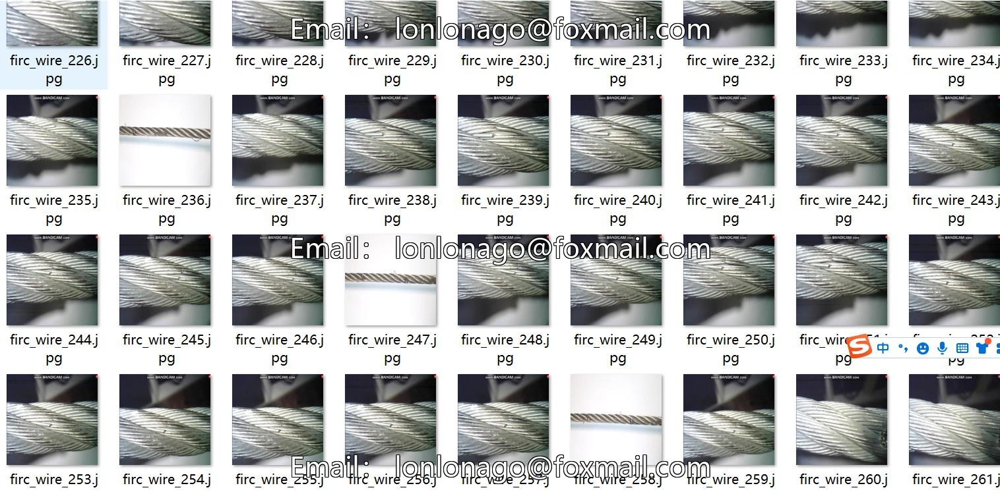
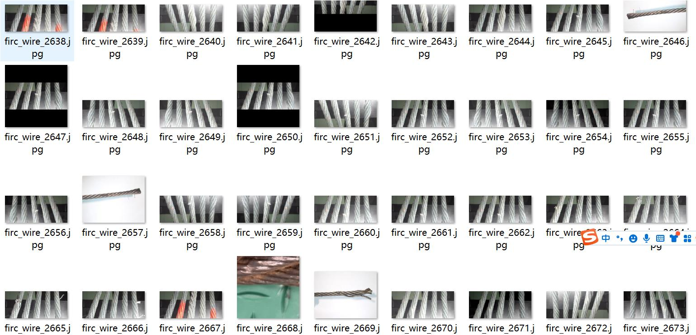
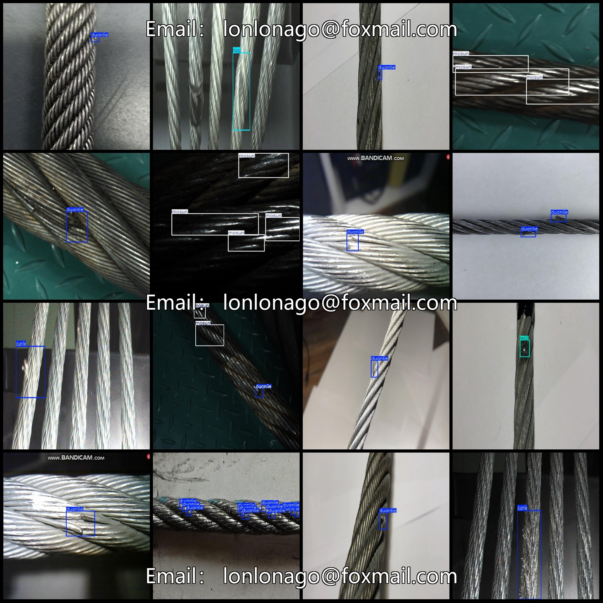
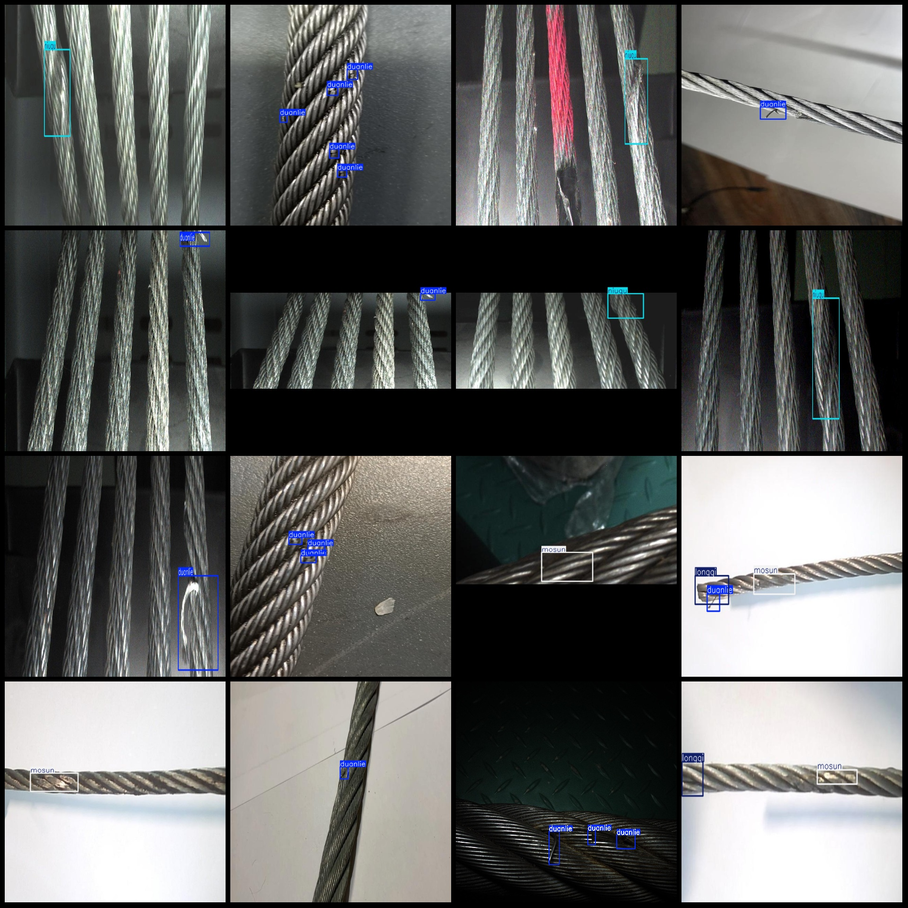

# Power Scene Steel Cable Detection Data Set with 3729 Images in VOC+YOLO Format, 5 Classes

Dataset format: Pascal VOC format + YOLO format (excluding split paths in txt files, only including jpg images and corresponding VOC format xml files and yolo format txt files)

Number of images (jpg file count): 3729
Number of annotations (xml file count): 3729
Number of annotations (txt file count): 3729
Number of annotation categories: 5
Annotation category names (noting that the order of categories in the yolo format is not consistent with this, but according to the labels folder classes.txt): ["duanlie", "leiji", "niuqu", "longqi", "mosun"]
Each category has a number of bounding boxes:
duanlie (broken) = 3981
leiji (lightning strike) = 781
niuqu (twisted) = 341
longqi (raised) = 166
mosun (wear and tear) = 2568
Total bounding box count: 7837
Image resolution: 640x640
Annotation tool used: labelImg
Annotation rules: draw bounding boxes for each category
Important note: The dataset does not have been divided into training, validation, or test sets; you should divide it yourself.
Special declaration: This dataset does not guarantee the accuracy of the models trained on it or the weight files.
Preview of images:
Example of annotation:
## Images

Here is a pay link on Stripe ( https://buy.stripe.com/3cs8yP7sY87d0vu9AB ). Please contact me lonlonago@foxmail.com after funding $89, and I will send you a complete data files , thank you!

